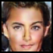

# PyTorch-ReverseGAN

PyTorch implementation of
"Precise Recovery of Latent Vectors from Generative Adversarial Networks"
[https://arxiv.org/abs/1702.04782](https://arxiv.org/abs/1702.04782).

Given the generated image `G(z)` with `z` unknown, the goal of ReverseGAN is to
find `z_approx` that approximates `z`. To achieve this, one can find `z_approx`
that minimizes `MSE(G(z_approx), G(z))` through gradient descent.

## Setups

### Dataset

Download the "Align&Cropped Images" from
[http://mmlab.ie.cuhk.edu.hk/projects/CelebA.html](http://mmlab.ie.cuhk.edu.hk/projects/CelebA.html)
and unzip.

### Training

```bash
python dcgan.py --dataset=folder --dataroot=/path/to/dataset --cuda
```
By default, the generated images and saved models will be saved in `dcgan_out`
directory.

### Reverse

After training, run
```bash
python dcgan_reverse.py --clip=stochastic --netG=pre_trained/netG_epoch_10.pth --cuda
```
where `--netG` points to the model saved during training.

### Example results

The following example uses the pre-trained model `pre_trained/netG_epoch_10.pth`
on CelebA aligned dataset.

`G(z)`: the generated image with `z`


`G(z_approx)`: the generated image with the estimated `z_approx`


## References
- DCGAN's implementation from
[PyTorch examples](https://github.com/pytorch/examples/tree/master/dcgan).
- Author's [TF implementation](https://github.com/SubarnaTripathi/ReverseGAN).
